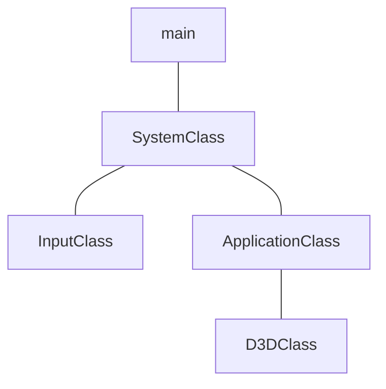

# Framework and Window


## main
```cpp
// dx11/nkrhua_dx11/Source/main.cpp
#include "../Headers/systemclass.h"

int WINAPI WinMain(HINSTANCE hInstance, HINSTANCE hPrevInstance,
                              PSTR pScmdline, int iCmdshow)
{

      SystemClass* System;
      bool result;
      
      System = new SystemClass;

      result = System->Initialize();
      if (result)
      {
            System->Run();
      }

      System->Shutdown();
      delete System;
      System = 0;
      
      return 0;
}
```
[WinMain](https://learn.microsoft.com/pt-br/windows/win32/api/winbase/nf-winbase-winmain) is the conventional name used for the application entry point, providing graphical Windows-based application.
### Parameters
#### `HINSTANCE hInstance`
A handle to the current instance of the application.
#### `HINSTANCE hPrevInstance`
A handle to the previous instance of the application. This parameter is always `NULL`. If you need to detect wheter another instance already exists, create a uniquely named `mutex`.
>[!Note]
>`HINSTANCE` is the handle to an instance or handle to a module. The operating system uses this value to identify the executable or EXE when it's loaded in memory.  It is simply a pointer to the memory image of the executable file.
#### `PSTR lpCmdLine`
The command line for the application, excluding the program name. To retrieve the entire command line, use the `GetCommandLine` function.
>[!Note]
>`PSTR` menas a pointer to a null-terminated string of 8-bit Windows (ANSI) characters.  These char-based string pointers can be used to represent ASCII strings, strings in some kind of multi-byte encoding, and even UTF-8-encoded strings.
#### `int iCmdshow`
Controls how the window is to be shown. This parameter can be any of the values that can be specified in the `nCmdShow` parameter for the [`ShowWindow`](https://learn.microsoft.com/en-us/windows/win32/api/winuser/nf-winuser-showwindow) function.
### Return Value
#### `TYPE: int`

If the function succeeds, terminating when it receibes a `WM_QUIT` message, it should return the exit value contained in that message's `wParam` parameter. If the function terminates before entering the message loop, it should return zero.

> [!NOTE]
> The name WinMain is used by convention by many programming frameworks. Your WinMain should initialize the application, display its main window and enter a message retrieval-and-dispatch loop that is the top-level control structure for the remainder of the application's execution. It terminates the message loop when receives a `WM_QUIT`message. If `WM_QUIT` was received as a result of calling `PostQuitMessage`, the value of `wParam` is the value of the `PostQuitMessage` function's `nExitCode` parameter.

---
## ApplicationClass
```cpp
// dx11/nkrhua_dx11/Headers/applicationclass.h
#ifndef _APPLICATIONCLASS_H_
#define _APPLICATIONCLASS_H_

#include "d3dclass.h"

const bool FULL_SCREEN = false;
const bool VSYNC_ENABLED = true;
const float SCREEN_DEPTH = 1000.0f;
const float SCREEN_NEAR = 0.3f;

class ApplicationClass
{
public:
	ApplicationClass();
	ApplicationClass(const ApplicationClass&);
	~ApplicationClass();

	bool Initialize(int, int, HWND);
	void Shutdown();
	bool Frame();

private:
	bool Render();
	D3DClass* m_Direct3D;
};
#endif;
```
#### `bool ApplicationClass::Initialize(int screenWidth, int screenHeight, HWND hwnd)`
```cpp
// dx11/nkrhua_dx11/Source/applicationclass.cpp
bool ApplicationClass::Initialize(int screenWidth, int screenHeight, HWND hwnd)
{
	bool result;

	m_Direct3D = new D3DClass;
	result = m_Direct3D->Initialize(screenWidth,
	screenHeight, VSYNC_ENABLED, hwnd, FULL_SCREEN,
	SCREEN_DEPTH, SCREEN_NEAR);
	
	if (!result)
	{
		MessageBox(hwnd, L"Could not initialize Direct3D",
		 L"Error", MB_OK);
		return false;
	}
	return true;
}
```

#### `void ApplicationClass::Shutdown()`
```cpp
// dx11/nkrhua_dx11/Source/applicationclass.cpp
void ApplicationClass::Shutdown()
{
	if (m_Direct3D)
	{
		m_Direct3D->Shutdown();
		delete m_Direct3D;
		m_Direct3D = 0;
	}

	return;
}
```
Shut down of all graphics objects occur here so we have placed the D3DClass shutdown in this function. 
#### `bool ApplicationClass::Frame()`
```cpp
// dx11/nkrhua_dx11/Source/applicationclass.cpp
bool ApplicationClass::Frame()
{
	bool result;

	result = Render();
	if (!result)
	{
		return false;
	}

	return true;
}
```
Frame function has been updated so that it now calls the Render function each frame.
#### `bool ApplicationClass::Render()`
```cpp
// dx11/nkrhua_dx11/Source/applicationclass.cpp
bool ApplicationClass::Render()
{
	m_Direct3D->BeginScene(0.5f, 0.5f, 0.5f, 1.0f);
	m_Direct3D->EndScene();
	
	return true;
}
```
We call the m_Direct3D object to clear the screen to a gray color. After that we call EndScene so that the grey color is presented to the window.
## InputClass
```cpp
// dx11/nkrhua_dx11/Headers/inputclass.h
#ifndef _INPUTCLASS_H_
#define _INPUTCLASS_H_

class InputClass
{
public:
	InputClass();
	InputClass(const InputClass&);
	~InputClass();

	void Initialize();

	void KeyDown(unsigned int);
	void KeyUp(unsigned int);

	bool IsKeyDown(unsigned int);

private:
	bool m_keys[256];
};
#endif

```
#### `void InputClass::Initialize()`
```cpp
// dx11/nkrhua_dx11/Source/inputclass.cpp
void InputClass::Initialize()
{
	int i;

	for (i = 0; i < 256; i++)
	{
		m_keys[i] = false;
	}

	return;
}
```
#### `void InputClass::KeyDown(unsigned int input)`
```cpp
// dx11/nkrhua_dx11/Source/inputclass.cpp
void InputClass::KeyDown(unsigned int input)
{
	m_keys[input] = true;
	return;
}
```
#### `void InputClass::KeyUp(unsigned int input)`
```cpp
// dx11/nkrhua_dx11/Source/inputclass.cpp
void InputClass::KeyUp(unsigned int input)
{
	m_keys[input] = false;
	return;
}
```
#### `bool InputClass::IsKeyDown(unsigned int key)`
```cpp
// dx11/nkrhua_dx11/Source/inputclass.cpp
bool InputClass::IsKeyDown(unsigned int key)
{
	return m_keys[key];
}
```
## SystemClass
```cpp
// dx11/nkrhua_dx11/Headers/systemclass.h
#ifndef _SYSTEMCLASS_H_
#define _SYSTEMCLASS_H_

#define WIN32_LEAN_AND_MEAN

#include <Windows.h>
#include "inputclass.h"
#include "applicationclass.h"

class SystemClass
{
public:
	SystemClass();
	SystemClass(const SystemClass&);
	~SystemClass();

	bool Initialize();
	void Shutdown();
	void Run();

	LRESULT CALLBACK MessageHandler(HWND, UINT, WPARAM, LPARAM);

private:
	bool Frame();
	void InitializeWindows(int&, int&);
	void ShutdownWindows();

	LPCWSTR m_applicationName;
	HINSTANCE m_hInstance;
	HWND m_hwnd;

	InputClass* m_Input;
	ApplicationClass* m_Application;
};

static LRESULT CALLBACK WndProc(HWND, UINT, WPARAM, LPARAM);

static SystemClass* ApplicationHandle = 0;

#endif
```
### Functions and Members
#### `bool Initialize();`
```cpp
// dx11/nkrhua_dx11/Source/systemclass.cpp

bool SystemClass::Initialize()
{
	int screenWidth, screenHeight;
	bool result;

	screenHeight = 0;
	screenWidth = 0;

	InitializeWindows(screenWidth, screenHeight);

	m_Input = new InputClass;
	m_Input->Initialize();

	m_Application = new ApplicationClass;

	result = m_Application->Initialize(screenWidth, screenHeight, m_hwnd);
	if (!result)
	{
		return false;
	}

	return true;
}
```
## D3DClass
```cpp
// dx11/nkrhua_dx11/Headers/d3dclass.h
#ifndef _D3DCLASS_H_
#define _D3DCLASS_H_

#pragma comment(lib, "d3d11.lib")
#pragma comment(lib, "dxgi.lib")
#pragma comment(lib, "d3dcompiler.lib")

#include <d3d11.h>
#include <DirectXMath.h>
using namespace DirectX;

class D3DClass
{
public:
	D3DClass();
	D3DClass(const D3DClass&);
	~D3DClass();

	bool Initialize(int, int, bool, HWND, bool, float, float);
	void Shutdown();

	void BeginScene(float, float, float, float);
	void EndScene();

	ID3D11Device* GetDevice();
	ID3D11DeviceContext* GetDeviceContext();

	void GetProjectionMatrix(XMMATRIX&);
	void GetWorldMatrix(XMMATRIX&);
	void GetOrthoMatrix(XMMATRIX&);

	void GetVideoCardInfo(char*, int&);

	void SetBackBufferRenderTarget();
	void ResetViewport();

private:
	bool m_vsync_enabled;
	int m_videoCardMemory;
	char m_videoCardDescription[128];
	
	IDXGISwapChain* m_swapChain;
	ID3D11Device* m_device;
	ID3D11DeviceContext* m_deviceContext;
	ID3D11RenderTargetView* m_renderTargetView;
	ID3D11Texture2D* m_depthStencilBuffer;
	ID3D11DepthStencilState* m_depthStencilState;
	ID3D11DepthStencilView* m_depthStencilView;
	ID3D11RasterizerState* m_rasterState;

	XMMATRIX m_projectionMatrix;
	XMMATRIX m_worldMatrix;
	XMMATRIX m_orthoMatrix;

	D3D11_VIEWPORT m_viewport;
};

#endif
```
So, lets talk about the headers and specified libraries.
- The first library, `"d3d11.lib"` contains all the Direct3D functionality for setting up and drawing 3D graphics in DirectX 11. 
- The second library, `"dxgi.lib"` contains tools to interface with the hardware on the computer to obtain information about the refresh rate of the monitor, the video card being used and so fourth.
- The third library, `"d3dcompiler.lib"` contains functionality for compiling shaders which we will cover later.
```cpp
#pragma comment(lib, "d3d11.lib")
#pragma comment(lib, "dxgi.lib") 
#pragma comment(lib, "d3dcompiler.lib")
```
So, with the specified libraries, the next thing we do is include the headers for DirectX type definitions and math functionality.
```cpp
#include <d3d11.h>
#include <directxmath.h>
using namespace DirectX;
```
#### `D3DClass::D3DClass()`
```cpp
// dx11/nkrhua_dx11/Source/systemclass.cpp
D3DClass::D3DClass()
{
	m_swapChain = 0;
	m_device = 0;
	m_deviceContext = 0;
	m_renderTargetView = 0;
	m_depthStencilBuffer = 0;
	m_depthStencilState = 0;
	m_depthStencilView = 0;
	m_rasterState = 0;
}
```
Like most classes, we begin with initializing all the member pointers to null in the class constructor. All pointers from the header file have all been accounted for here.
#### `bool D3DClass::Initialize(int screenWidth, int screenHeight, bool vsync, HWND hwnd, bool fullscreen, float screenDepth, float screenNear)`
```cpp
bool D3DClass::Initialize(int screenWidth, int screenHeight, bool vsync, HWND hwnd, bool fullscreen, float screenDepth, float screenNear)
{
	HRESULT result;
	IDXGIFactory* factory;
	IDXGIAdapter* adapter;
	IDXGIOutput* adapterOutput;
	unsigned int numModes, i, numerator, denominator;
	unsigned long long stringLength;
	DXGI_MODE_DESC* displayModeList;
	DXGI_ADAPTER_DESC adapterDesc;
	int error;
	DXGI_SWAP_CHAIN_DESC swapChainDesc;
	D3D_FEATURE_LEVEL featureLevel;
	ID3D11Texture2D* backBufferPtr;
	D3D11_TEXTURE2D_DESC depthBufferDesc;
	D3D11_DEPTH_STENCIL_DESC depthStencilDesc;
	D3D11_DEPTH_STENCIL_VIEW_DESC depthStencilViewDesc;
	D3D11_RASTERIZER_DESC rasterDesc;
	float fieldOfView, screenAspect;


	// Store the vsync setting.
	m_vsync_enabled = vsync;
```
The Intialize function is what does the entire setup of Direct3D for DirectX 11. 
- The screenWidth and screenHeight of the window are given to this function, those are the same variables created previously in the SystemClass. 
- The hwnd variable is a handle to the window. Direct3D will need this handle to access the window we previously created.
- The fullscreen variable is whether we are running in windowed mode or fullscreen. Direct3D needs this as well for creating the window with the correct settings. 
- The screenDepth and screenNear are the depth settings for our 3D environment that will be rendered in the window. 
- The vsync variable indicates if we want Direct3D to render according to the users monitor refresh rate or just go as fast as possible.

>[!Note]
>Before we can initialize Direct3D, we have to get the refresh rate from the video card/monitor. Each computer may be slightly different so we will need to query for that information. We query for the numerator and denominator values and then pass them to DirectX during the setup and it will calculate the proper refresh rate. If we don't do this and just set the refresh rate to a default value which may not exist on all computers, then DirectX will respond by performing a blit instead of a buffer flip which will degrade performance and give us annoying errors in the debug output.

Getting the numerator and denominator values of the refresh rate from the monitor/video card:
```cpp
//	Create the DirectX graphics interface:
	result = CreateDXGIFactory(__uuidof(IDXGIFactory), (void**)&factory);
	if (FAILED(result))
	{
		return false;
	}

//	Use the factory to create an adapter for the primary graphics interface (memory card):
	result = factory->EnumAdapters(0, &adapter);
	if (FAILED(result))
	{
		return false;
	}

//	Enumerate the primary adapter output (monitor):
	result = adapter->EnumOutputs(0, &adapterOutput);
	if (FAILED(result))
	{
		return false;
	}
	
//	Get the number of modes that fit the DXGI_FORMAT_R8G8B8A8_UNORM display format for the adapter output (monitor):
	result = adapterOutput->GetDisplayModeList(DXGI_FORMAT_R8G8B8A8_UNORM, DXGI_ENUM_MODES_INTERLACED, &numModes, NULL);
	if (FAILED(result))
	{
		return false;
	}

  	displayModeList = new DXGI_MODE_DESC[numModes];
	if (!displayModeList)
	{
		return false;
	}

// Now fill the display mode list structures.
	result = adapterOutput->GetDisplayModeList(DXGI_FORMAT_R8G8B8A8_UNORM, DXGI_ENUM_MODES_INTERLACED, &numModes, displayModeList);
	if (FAILED(result))
	{
		return false;
	}

//	Now go through all the display modes and find the one that matches the screen width and height;
//	When a match is found store the numerator and denominator of the refresh rate for that monitor:
	for (i = 0; i < numModes; i++)
	{
		if (displayModeList[i].Width == (unsigned int)screenWidth)
		{
			if (displayModeList[i].Height == (unsigned int)screenHeight)
			{
				numerator = displayModeList[i].RefreshRate.Numerator;
				denominator = displayModeList[i].RefreshRate.Denominator;
			}
		}
	}
```
So, now we have the numerator and denominator for the refresh rate. The last thing we will need to query by using the adapter is the name of the video card and the amount of video memory:
```cpp
//	Now using the adapter we will retrieve the name of the video card and amount of video memory.
//	Get the adapter (video card) description:
	result = adapter->GetDesc(&adapterDesc);
	if (FAILED(result))
	{
		return false;
	}

//	Store the dedicated video card memory in megabytes:
	m_videoCardMemory = (int)(adapterDesc.DedicatedVideoMemory / 1024 / 1024);

//	Convert the name of the video card to a character array and store it:
	error = wcstombs_s(&stringLength, m_videoCardDescription, 128, adapterDesc.Description, 128);
	if (error != 0)
	{
		return false;
	}
```
So, now with the proper refresh rate from the system, we can start the DirectX initialization. The first thing we'll do is fill out the description of the swap chain.
> [!Note] 
> The swap chain is the front and back buffer to which the graphics will be drawn.
> In Direct3D, a swap chain is a collection of buffers used for displaying frames to the user. Each time an application presents a new frame, the first buffer in the swap chain takes the place of the displayed buffer, a process known as swapping or flipping.  Generally, you use a single back buffer, do all your drawing to it and then swap it to the front buffer which then displays on the screen. 
> - It serves to avoid tearing, which occurs when the monitor displays parts of multiple frames simultaneously, by synchronizing the frame presentation with the monitor's refresh rate.
> - It allows for double buffering, where one buffer is displayed while the other is being drawn to. This ensures smooth and continuous rendering.
> - By managing multiple buffers, the swap chain helps optimize rendering performance and visual quality.
> 
> When creating a swap chain, you need to fill in its description to define several key characteristics:
> - Buffer Count: Number of buffers in the chain.
> - Buffer Format: The format of the buffers (e.g. color depth).
> - Buffer Usage: How the buffers will be used (e.g. render target).
> - Output Window: The window where the frames will be displayed.
> - Sample description: Multi-sampling parameters for anti-aliasing.
> - Swap Effect: How the buffers are swapped (e.g., discard, sequential).
```cpp
//	Initialize the swap chain description:
	ZeroMemory(&swapChainDesc, sizeof(swapChainDesc));

//	Set to a single back buffer:
	swapChainDesc.BufferCount = 1;

//	Set the width and height of the back buffer:
	swapChainDesc.BufferDesc.Width = screenWidth;
	swapChainDesc.BufferDesc.Height = screenHeight;

//	Set the regular 32-bit surface for the back buffer:
	swapChainDesc.BufferDesc.Format = DXGI_FORMAT_R8G8B8A8_UNORM;
```
The next part of the description of the swap chain is the refresh rate. The refresh rate is how many times a second it will draws the back buffer to the front buffer. If vsync is set to true in our applicationclass.h header, then this will lock the refresh rate to the system settings. That means it will only draw the screen 60 times a second (or higher if the system refresh rate be superior). However, if we set vsync to false, then it will draw the screen as many times as it can, which can cause some visual artifacts.
```cpp
//	Set the refresh rate of the back buffer:
	if (m_vsync_enabled)
	{
		swapChainDesc.BufferDesc.RefreshRate.Numerator = numerator;
		swapChainDesc.BufferDesc.RefreshRate.Denominator = denominator;
	}
	else
	{
		swapChainDesc.BufferDesc.RefreshRate.Numerator = 0;
		swapChainDesc.BufferDesc.RefreshRate.Denominator = 1;
	}

//	Set the usage of the back buffer:
	swapChainDesc.BufferUsage = DXGI_USAGE_RENDER_TARGET_OUTPUT;

//	Set the handle for the window to render to:
	swapChainDesc.OutputWindow = hwnd;

//	Turn multisampling off:
	swapChainDesc.SampleDesc.Count = 1;
	swapChainDesc.SampleDesc.Quality = 0;

//	Set to fullscreen of windowed mode:
	if (fullscreen)
	{
		swapChainDesc.Windowed = false;
	}
	else
	{
		swapChainDesc.Windowed = true;
	}

//	Set the scan line ordering and scaling to unspecified:
	swapChainDesc.BufferDesc.ScanlineOrdering = DXGI_MODE_SCANLINE_ORDER_UNSPECIFIED;
	swapChainDesc.BufferDesc.Scaling = DXGI_MODE_SCALING_UNSPECIFIED;

//	Discard the back buffer contents after presenting:
	swapChainDesc.SwapEffect = DXGI_SWAP_EFFECT_DISCARD;

//	Dont set the advanced flags:
	swapChainDesc.Flags = 0;
```
After setting up the swap chain description, we also need to setup one more variable called the feature level. This variable tells which version of DirectX we want to use.
```cpp
// Set the feature level to DirectX 11.
	featureLevel = D3D_FEATURE_LEVEL_11_0;
```

Now that the swap chain description and feature level have been filled out, we can create the swap chain itself, the Direct3D device and the Direct3D Device Context. 

> [!Note] 
> Direct3D Device <br>
> The device is responsible for creating resources such as buffers, textures and shaders. It also enumerates the capabilities of the display adapter.
> - It is represented by the `ID3D11Device` Interface.
> - You create a device using functions like `D3D11CreateDevice` or `D3D11CreateDeviceAndSwapChain`.
> - Each application typically has one device, which can be used to create multiple resources.

> [!Note] 
> Direct3D DeviceContext <br>
> The DeviceContext is used to set pipeline states and issue rendering commands. It manages the state of the GPU and handles the rendering process.
> - Represented by the ID3D11DeviceContext interface.
> - Typically there are two types of Device Context:
> 	- Immediate Context: 
> 	Used for immediate rendering commands. Each device has one immediate context, which can be retrieved by using `ID3D11Device::GetImmediateContext`.
> 	- Deferred Context:
> 	Used to record commands that can be executed later, primarily useful for multithreading. You can create a deferred context using `ID3D11Device::CreateDeferredContext`.

Setting up the Swap Chain, Device and DeviceContext:
```cpp
//	Create the swap chain, Direct3D device and Direct3D device context:
	result = D3D11CreateDeviceAndSwapChain(NULL, 
	D3D_DRIVER_TYPE_HARDWARE, NULL, 0, &featureLevel, 1,
	D3D11_SDK_VERSION, &swapChainDesc, &m_swapChain, &m_device, 
	NULL, &m_deviceContext);
	if (FAILED(result))
	{
		return false;
	}
```
Now that we have the swap chain, we need to get a pointer to the back buffer and then attach it to the swap chain so we'll use the CreateRenderTargetView function to attach the back buffer to our swap chain:
```cpp
//	Get the pointer to the back buffer.
	result = m_swapChain->GetBuffer(0, __uuidof(ID3D11Texture2D),
						 (LPVOID*)&backBufferPTR);
	if (FAILED(result))
	{
		return false;
	}

//	Create the render target view with the back buffer pointer:
	result = m_device->CreateRenderTargetView(backBufferPTR, NULL,
						&m_renderTargetView);
	if (FAILED(result))
	{
		return false;
	}


//	Release pointer to the back buffer as we no longer need it:
	backBufferPTR->Release();
	backBufferPTR = 0;
```
We will also need to set up a depth buffer description. We'll use this so our polygons can be rendered properly in 3D space. At the same time, we will attach a stencil buffer to our depth buffer. The stencil buffer can be used to achieve effects such as motion blur, volumetric shadows and other shiny things.

```cpp
//	Initialize the description of the depth buffer.
	ZeroMemory(&depthBufferDesc, sizeof(depthBufferDesc));

//	Setup the description of the depth buffer:
	depthBufferDesc.Width = screenWidth;
	depthBufferDesc.Height = screenHeight;
	depthBufferDesc.MipLevels = 1;
	depthBufferDesc.ArraySize = 1;
	depthBufferDesc.Format = DXGI_FORMAT_D24_UNORM_S8_UINT;
	depthBufferDesc.SampleDesc.Count = 1;
	depthBufferDesc.SampleDesc.Quality = 0;
	depthBufferDesc.Usage = D3D11_USAGE_DEFAULT;
	depthBufferDesc.BindFlags = D3D11_BIND_DEPTH_STENCIL;
	depthBufferDesc.CPUAccessFlags = 0;
	depthBufferDesc.MiscFlags = 0;
```
> [!Note]
> `D3D11_TEXTURE2D_DESC depthBufferDesc;`
> It is a structure of the Direct3D 11 API, which is used for handling 2D textures. This structure describes the properties of a 2D texture, including its width, height and usage.

Now we create the depth/stencil buffer using that description. Notice we use the CreateTexture2D function to make the buffers, hence the buffer is just a 2D texture. The reason is that once the polygons are sorted and rasterized, they just end up being colored pixels in this 2D buffer. Then this 2D buffer is drawn to the screen.

```cpp
// Create the texture for the depth buffer using the filled out description.
	result = m_device->CreateTexture2D(&depthBufferDesc, NULL,
						&m_depthStencilBuffer);
	if(FAILED(result))
	{
		return false;
	}
```
So lets setup the depth stencil description. This allows us to control what type of depth test Direct3D will do for each pixel.

```cpp
//	Initialize the description of the stencil state:
	ZeroMemory(&depthStencilDesc, sizeof(depthStencilDesc));

//	Set up the description of the stencil state:
	depthStencilDesc.DepthEnable = true;
	depthStencilDesc.DepthWriteMask = D3D11_DEPTH_WRITE_MASK_ALL;
	depthStencilDesc.DepthFunc = D3D11_COMPARISON_LESS;

	depthStencilDesc.StencilEnable = true;
	depthStencilDesc.StencilReadMask = 0xFF;
	depthStencilDesc.StencilWriteMask = 0xFF;

//	Stencil operations if pixel is front-facing:
	depthStencilDesc.FrontFace.StencilFailOp = D3D11_STENCIL_OP_KEEP;
	depthStencilDesc.FrontFace.StencilDepthFailOp = D3D11_STENCIL_OP_INCR;
	depthStencilDesc.FrontFace.StencilPassOp = D3D11_STENCIL_OP_KEEP;
	depthStencilDesc.FrontFace.StencilFunc = D3D11_COMPARISON_ALWAYS;

// Stencil operations if pixel is back-facing.
	depthStencilDesc.BackFace.StencilFailOp = D3D11_STENCIL_OP_KEEP;
	depthStencilDesc.BackFace.StencilDepthFailOp = D3D11_STENCIL_OP_DECR;
	depthStencilDesc.BackFace.StencilPassOp = D3D11_STENCIL_OP_KEEP;
	depthStencilDesc.BackFace.StencilFunc = D3D11_COMPARISON_ALWAYS;

```
And so, we can create the depth stencil state.

```cpp
// Create the depth stencil state.
	result = m_device->CreateDepthStencilState(&depthStencilDesc,
		 &m_depthStencilState);
	if (FAILED(result))
	{
		return false;
	}
```

With it created, we can set this change into the deviceContext, so it actually takes on:
```cpp
	m_deviceContext->OMSetDepthStencilState(m_depthStencilState, 1);
```
As we finish the description of the view of the depth stencil buffer, we create its view. We do this so that Direct3D knows to use the depth buffer as a depth stencil texture. After filling out the description, we call the function `CreateDepthStencilView` to create it.

```cpp
//	Initialize the depth stencil view:
	ZeroMemory(&depthStencilViewDesc, sizeof(depthStencilViewDesc));

//	Setup the depth stencil view description:
	depthStencilViewDesc.Format = DXGI_FORMAT_D24_UNORM_S8_UINT;
	depthStencilViewDesc.ViewDimension = D3D11_DSV_DIMENSION_TEXTURE2D;
	depthStencilViewDesc.Texture2D.MipSlice = 0;

//	Create the depth stencil view:
	result = m_device->CreateDepthStencilView(m_depthStencilBuffer, 
			&depthStencilViewDesc, &m_depthStencilView);
	if (FAILED(result))
	{
		return false;
	}

```
With that created, we call the `OMSetRenderTarget`. This will bind the render target view and the depth stencil buffer to the output render pipeline. This way, the graphics that the pipeline randers will get drawn to our back buffer that we previously created. With the graphics written to the back buffer, we can then swap it to the front and display our graphics on the user's screen.
```cpp
//	Bind the render target view and depth stencil buffer to the output render pipeline:
	m_deviceContext->OMSetRenderTargets(1, &m_renderTargetView, m_depthStencilView);
```
Now that the targets are setup we can continue on to some extra functions that gives us more control over our scenes for future modifications. First we will create is a rasterizer state. This will give us control over how polygons are rendered. We can do things like make our scenes render in wireframe mode or have DirectX draw both the front and back faces of polygons.
By default, DirectX already has a rasterizer state set up and working the exact same as the one below, however you have no control over how to change it unless you set up one yourself, as we are doing now:
```cpp
//	Setup the raster description which will determine how and what polygons will be drawn:
	rasterDesc.AntialiasedLineEnable = false;
	rasterDesc.CullMode = D3D11_CULL_BACK;
	rasterDesc.DepthBias = 0;
	rasterDesc.DepthBiasClamp = 0.0f;
	rasterDesc.DepthClipEnable = true;
	rasterDesc.FillMode = D3D11_FILL_SOLID;
	rasterDesc.FrontCounterClockwise = false;
	rasterDesc.MultisampleEnable = false;
	rasterDesc.ScissorEnable = false;
	rasterDesc.SlopeScaledDepthBias = 0.0f;

//	Create the rasterizer state from the description we just filled out:
	result = m_device->CreateRasterizerState(&rasterDesc, &m_rasterState);
	if (FAILED(result))
	{
		return false;
	}

//	Now set the rasterizer state:
	m_deviceContext->RSSetState(m_rasterState);
```
The viewport also needs to be setup so that Direct3D can map clip space coordinates to the render target space. Set this to be the entire size of the window:
```cpp
// Setup the viewport for rendering:
	m_viewport.Width = (float)screenWidth;
	m_viewport.Height = (float)screenHeight;
	m_viewport.MinDepth = 0.0f;
	m_viewport.MaxDepth = 1.0f;
	m_viewport.TopLeftX = 0.0f;
	m_viewport.TopLeftY = 0.0f;

//	Create the viewport
	m_deviceContext->RSSetViewports(1, &m_viewport);
```

Now we will create the projection matrix. It is used to translate the 3D scene into the 2D viewport space that we had created. We will need to keep a copy of this matrix so that we can pass it to our shaders that will be used to render our scenes.

```cpp
//	Setup the projection matrix:
	fieldOfView = 3.141592654f / 4.0f;
	screenAspect = (float)screenWidth / (float)screenHeight;

//	Create the projection matrix for the 3D rendering:
	m_projectionMatrix = XMMatrixPerspectiveFovLH(fieldOfView, screenAspect,
	 screenNear, screenDepth);
```

We will also create another matrix called m_WorldMatrix. This is used to convert the vertices of our objects into vertices in the 3D scene. This matrix will also be used to rotate, translate and scale objects in 3D space. 
```cpp
//	Initialize the world matrix to the identity matrix:
	m_worldMatrix = XMMatrixIdentity();
```
The final thing we will setup in the initialize function is an orthographic projection matrix. This matrix is used for rendering 2D elements like user interfaces on the screen allowing us to skip the 3D rendering.
```cpp
//	Create an orthographic projection matrix for 2D rendering:
	m_orthoMatrix = XMMatrixOrthographicLH((float)screenWidth,
	(float)screenHeight, screenNear, screenDepth);

	return true;
}
```