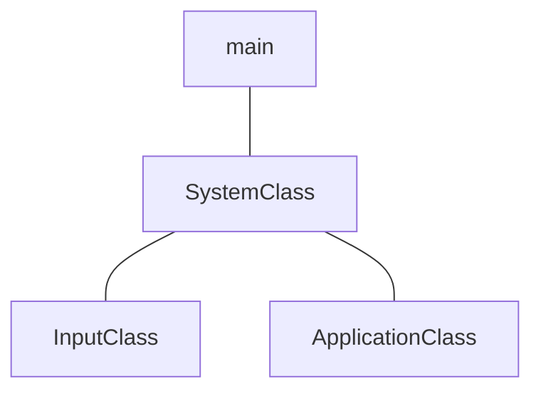

# Framework and Window


## WinMain - Main
```cpp
#include "../Headers/systemclass.h"

int WINAPI WinMain(HINSTANCE hInstance, HINSTANCE hPrevInstance, 
					PSTR pScmdline, int iCmdshow)
{
	SystemClass* System;
	bool result;

	System = new SystemClass;

	result = System->Initialize();
	if (result)
	{
		System->Run();
	}
	
	System->Shutdown();
	delete System;
	System = 0;
	
	return 0;
}
```

[WinMain](https://learn.microsoft.com/pt-br/windows/win32/api/winbase/nf-winbase-winmain) is the conventional name used for the application entry point, providing graphical Windows-based application.
### Parameters

#### `HINSTANCE hInstance`
A handle to the current instance of the application.
#### `HINSTANCE hPrevInstance`
A handle to the previous instance of the application. This parameter is always `NULL`. If you need to detect wheter another instance already exists, create a uniquely named `mutex`. 
#### `PSTR lpCmdLine`
The command line for the application, excluding the program name. To retrieve the entire command line, use the `GetCommandLine` function.
#### `int iCmdshow`
Controls how the window is to be shown. This parameter can be any of the values that can be specified in the `nCmdShow` parameter for the [`ShowWindow`](https://learn.microsoft.com/en-us/windows/win32/api/winuser/nf-winuser-showwindow) function. 

### Return Value
#### `TYPE: int`
If the function succeeds, terminating when it receibes a `WM_QUIT` message, it should return the exit value contained in that message's `wParam` parameter. If the function terminates before entering the message loop, it should return zero.