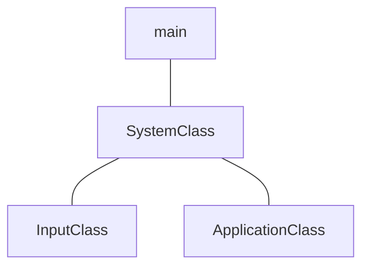

# Framework and Window


## main.cpp
```cpp
// dx11/nkrhua_dx11/Source/main.cpp
#include "../Headers/systemclass.h"

int WINAPI WinMain(HINSTANCE hInstance, HINSTANCE hPrevInstance,
                              PSTR pScmdline, int iCmdshow)
{

      SystemClass* System;
      bool result;
      
      System = new SystemClass;

      result = System->Initialize();
      if (result)
      {
            System->Run();
      }

      System->Shutdown();
      delete System;
      System = 0;
      
      return 0;
}
```
[WinMain](https://learn.microsoft.com/pt-br/windows/win32/api/winbase/nf-winbase-winmain) is the conventional name used for the application entry point, providing graphical Windows-based application.
### Parameters
#### `HINSTANCE hInstance`
A handle to the current instance of the application.
#### `HINSTANCE hPrevInstance`
A handle to the previous instance of the application. This parameter is always `NULL`. If you need to detect wheter another instance already exists, create a uniquely named `mutex`.
>[!Note]
>`HINSTANCE` is the handle to an instance or handle to a module. The operating system uses this value to identify the executable or EXE when it's loaded in memory.  It is simply a pointer to the memory image of the executable file.
#### `PSTR lpCmdLine`
The command line for the application, excluding the program name. To retrieve the entire command line, use the `GetCommandLine` function.
>[!Note]
>`PSTR` menas a pointer to a null-terminated string of 8-bit Windows (ANSI) characters.  These char-based string pointers can be used to represent ASCII strings, strings in some kind of multi-byte encoding, and even UTF-8-encoded strings.
#### `int iCmdshow`
Controls how the window is to be shown. This parameter can be any of the values that can be specified in the `nCmdShow` parameter for the [`ShowWindow`](https://learn.microsoft.com/en-us/windows/win32/api/winuser/nf-winuser-showwindow) function.
### Return Value
#### `TYPE: int`

If the function succeeds, terminating when it receibes a `WM_QUIT` message, it should return the exit value contained in that message's `wParam` parameter. If the function terminates before entering the message loop, it should return zero.

> [!NOTE]
> The name WinMain is used by convention by many programming frameworks. Your WinMain should initialize the application, display its main window and enter a message retrieval-and-dispatch loop that is the top-level control structure for the remainder of the application's execution. It terminates the message loop when receives a `WM_QUIT`message. If `WM_QUIT` was received as a result of calling `PostQuitMessage`, the value of `wParam` is the value of the `PostQuitMessage` function's `nExitCode` parameter.

---
## ApplicationClass.h
```cpp
// dx11/nkrhua_dx11/Headers/applicationclass.h
#ifndef _APPLICATIONCLASS_H_
#define _APPLICATIONCLASS_H_

#include <Windows.h>

const bool FULL_SCREEN = false;
const bool VSYNC_ENABLED = true;
const float SCREEN_DEPTH = 1000.0f;
const float SCREEN_NEAR = 0.3f;

class ApplicationClass
{
public:
	ApplicationClass();
	ApplicationClass(const ApplicationClass&);
	~ApplicationClass();

	bool Initialize(int, int, HWND);
	void Shutdown();
	bool Frame();

private:
	bool Render();
};
#endif;
```
### `bool Initialize(int, int, HWND);`
```cpp
// dx11/nkrhua_dx11/Source/applicationclass.cpp
bool ApplicationClass::Initialize(int screenWidth, int screenHeight, 
								  HWND hwnd)
{
	return true;
}
```
### `void Shutdown();`
```cpp
// dx11/nkrhua_dx11/Source/applicationclass.cpp
void ApplicationClass::Shutdown()
{
	return;
}
```
### `bool Frame();`
```cpp
// dx11/nkrhua_dx11/Source/applicationclass.cpp
bool ApplicationClass::Frame()
{
	return true;
}
```
### `bool Render();`
```cpp
// dx11/nkrhua_dx11/Source/applicationclass.cpp
bool ApplicationClass::Render()
{
	return true;
}
```
## SystemClass.h
```cpp
// dx11/nkrhua_dx11/Headers/systemclass.h
#ifndef _SYSTEMCLASS_H_
#define _SYSTEMCLASS_H_

#define WIN32_LEAN_AND_MEAN

#include <Windows.h>
#include "inputclass.h"
#include "applicationclass.h"

class SystemClass
{
public:
	SystemClass();
	SystemClass(const SystemClass&);
	~SystemClass();

	bool Initialize();
	void Shutdown();
	void Run();

	LRESULT CALLBACK MessageHandler(HWND, UINT, WPARAM, LPARAM);

private:
	bool Frame();
	void InitializeWindows(int&, int&);
	void ShutdownWindows();

	LPCWSTR m_applicationName;
	HINSTANCE m_hInstance;
	HWND m_hwnd;

	InputClass* m_Input;
	ApplicationClass* m_Application;
};

static LRESULT CALLBACK WndProc(HWND, UINT, WPARAM, LPARAM);

static SystemClass* ApplicationHandle = 0;

#endif
```
### Functions and Members
#### `bool Initialize();`
```cpp
// dx11/nkrhua_dx11/Source/systemclass.cpp

bool SystemClass::Initialize()
{
	int screenWidth, screenHeight;
	bool result;

	screenHeight = 0;
	screenWidth = 0;

	InitializeWindows(screenWidth, screenHeight);

	m_Input = new InputClass;
	m_Input->Initialize();

	m_Application = new ApplicationClass;

	result = m_Application->Initialize(screenWidth, screenHeight,
										 m_hwnd);
	if (!result)
	{
		return false;
	}

	return true;
}
```