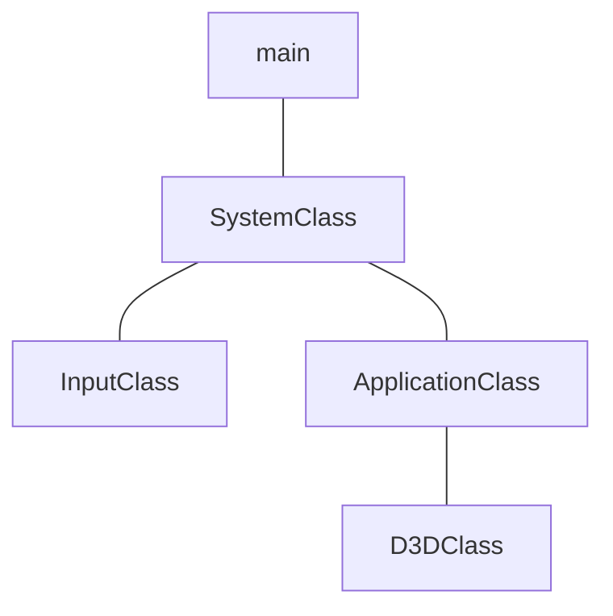

# Framework and Window


## main
```cpp
// dx11/nkrhua_dx11/Source/main.cpp
#include "../Headers/systemclass.h"

int WINAPI WinMain(HINSTANCE hInstance, HINSTANCE hPrevInstance,
                              PSTR pScmdline, int iCmdshow)
{

      SystemClass* System;
      bool result;
      
      System = new SystemClass;

      result = System->Initialize();
      if (result)
      {
            System->Run();
      }

      System->Shutdown();
      delete System;
      System = 0;
      
      return 0;
}
```
[WinMain](https://learn.microsoft.com/pt-br/windows/win32/api/winbase/nf-winbase-winmain) is the conventional name used for the application entry point, providing graphical Windows-based application.
### Parameters
#### `HINSTANCE hInstance`
A handle to the current instance of the application.
#### `HINSTANCE hPrevInstance`
A handle to the previous instance of the application. This parameter is always `NULL`. If you need to detect wheter another instance already exists, create a uniquely named `mutex`.
>[!Note]
>`HINSTANCE` is the handle to an instance or handle to a module. The operating system uses this value to identify the executable or EXE when it's loaded in memory.  It is simply a pointer to the memory image of the executable file.
#### `PSTR lpCmdLine`
The command line for the application, excluding the program name. To retrieve the entire command line, use the `GetCommandLine` function.
>[!Note]
>`PSTR` menas a pointer to a null-terminated string of 8-bit Windows (ANSI) characters.  These char-based string pointers can be used to represent ASCII strings, strings in some kind of multi-byte encoding, and even UTF-8-encoded strings.
#### `int iCmdshow`
Controls how the window is to be shown. This parameter can be any of the values that can be specified in the `nCmdShow` parameter for the [`ShowWindow`](https://learn.microsoft.com/en-us/windows/win32/api/winuser/nf-winuser-showwindow) function.
### Return Value
#### `TYPE: int`

If the function succeeds, terminating when it receibes a `WM_QUIT` message, it should return the exit value contained in that message's `wParam` parameter. If the function terminates before entering the message loop, it should return zero.

> [!NOTE]
> The name WinMain is used by convention by many programming frameworks. Your WinMain should initialize the application, display its main window and enter a message retrieval-and-dispatch loop that is the top-level control structure for the remainder of the application's execution. It terminates the message loop when receives a `WM_QUIT`message. If `WM_QUIT` was received as a result of calling `PostQuitMessage`, the value of `wParam` is the value of the `PostQuitMessage` function's `nExitCode` parameter.

---
## ApplicationClass
```cpp
// dx11/nkrhua_dx11/Headers/applicationclass.h
#ifndef _APPLICATIONCLASS_H_
#define _APPLICATIONCLASS_H_

#include "d3dclass.h"

const bool FULL_SCREEN = false;
const bool VSYNC_ENABLED = true;
const float SCREEN_DEPTH = 1000.0f;
const float SCREEN_NEAR = 0.3f;

class ApplicationClass
{
public:
	ApplicationClass();
	ApplicationClass(const ApplicationClass&);
	~ApplicationClass();

	bool Initialize(int, int, HWND);
	void Shutdown();
	bool Frame();

private:
	bool Render();
	D3DClass* m_Direct3D;
};
#endif;
```
#### `bool ApplicationClass::Initialize(int screenWidth, int screenHeight, HWND hwnd)`
```cpp
// dx11/nkrhua_dx11/Source/applicationclass.cpp
bool ApplicationClass::Initialize(int screenWidth, int screenHeight, HWND hwnd)
{
	bool result;

	m_Direct3D = new D3DClass;
	result = m_Direct3D->Initialize(screenWidth,
	screenHeight, VSYNC_ENABLED, hwnd, FULL_SCREEN,
	SCREEN_DEPTH, SCREEN_NEAR);
	
	if (!result)
	{
		MessageBox(hwnd, L"Could not initialize Direct3D",
		 L"Error", MB_OK);
		return false;
	}
	return true;
}
```
We send this function the screen width, height, handle to the window and four global variables from the ApplicationClass.h file. The D3DClass will use all these variables to setup the Direct3D system.
#### `void ApplicationClass::Shutdown()`
```cpp
// dx11/nkrhua_dx11/Source/applicationclass.cpp
void ApplicationClass::Shutdown()
{
	if (m_Direct3D)
	{
		m_Direct3D->Shutdown();
		delete m_Direct3D;
		m_Direct3D = 0;
	}

	return;
}
```
Shut down of all graphics objects occur here so we have placed the D3DClass shutdown in this function. 
#### `bool ApplicationClass::Frame()`
```cpp
// dx11/nkrhua_dx11/Source/applicationclass.cpp
bool ApplicationClass::Frame()
{
	bool result;

	result = Render();
	if (!result)
	{
		return false;
	}

	return true;
}
```
Frame function has been updated so that it now calls the Render function each frame.
#### `bool ApplicationClass::Render()`
```cpp
// dx11/nkrhua_dx11/Source/applicationclass.cpp
bool ApplicationClass::Render()
{
	m_Direct3D->BeginScene(0.5f, 0.5f, 0.5f, 1.0f);
	m_Direct3D->EndScene();
	
	return true;
}
```
We call the m_Direct3D object to clear the screen to a gray color. After that we call EndScene so that the grey color is presented to the window.
## InputClass
```cpp
// dx11/nkrhua_dx11/Headers/inputclass.h
#ifndef _INPUTCLASS_H_
#define _INPUTCLASS_H_

class InputClass
{
public:
	InputClass();
	InputClass(const InputClass&);
	~InputClass();

	void Initialize();

	void KeyDown(unsigned int);
	void KeyUp(unsigned int);

	bool IsKeyDown(unsigned int);

private:
	bool m_keys[256];
};
#endif

```
#### `void InputClass::Initialize()`
```cpp
// dx11/nkrhua_dx11/Source/inputclass.cpp
void InputClass::Initialize()
{
	int i;

	for (i = 0; i < 256; i++)
	{
		m_keys[i] = false;
	}

	return;
}
```
#### `void InputClass::KeyDown(unsigned int input)`
```cpp
// dx11/nkrhua_dx11/Source/inputclass.cpp
void InputClass::KeyDown(unsigned int input)
{
	m_keys[input] = true;
	return;
}
```
#### `void InputClass::KeyUp(unsigned int input)`
```cpp
// dx11/nkrhua_dx11/Source/inputclass.cpp
void InputClass::KeyUp(unsigned int input)
{
	m_keys[input] = false;
	return;
}
```
#### `bool InputClass::IsKeyDown(unsigned int key)`
```cpp
// dx11/nkrhua_dx11/Source/inputclass.cpp
bool InputClass::IsKeyDown(unsigned int key)
{
	return m_keys[key];
}
```
## SystemClass
```cpp
// dx11/nkrhua_dx11/Headers/systemclass.h
#ifndef _SYSTEMCLASS_H_
#define _SYSTEMCLASS_H_

#define WIN32_LEAN_AND_MEAN

#include <Windows.h>
#include "inputclass.h"
#include "applicationclass.h"

class SystemClass
{
public:
	SystemClass();
	SystemClass(const SystemClass&);
	~SystemClass();

	bool Initialize();
	void Shutdown();
	void Run();

	LRESULT CALLBACK MessageHandler(HWND, UINT, WPARAM, LPARAM);

private:
	bool Frame();
	void InitializeWindows(int&, int&);
	void ShutdownWindows();

	LPCWSTR m_applicationName;
	HINSTANCE m_hInstance;
	HWND m_hwnd;

	InputClass* m_Input;
	ApplicationClass* m_Application;
};

static LRESULT CALLBACK WndProc(HWND, UINT, WPARAM, LPARAM);

static SystemClass* ApplicationHandle = 0;

#endif
```
### Functions and Members
#### `bool Initialize();`
```cpp
// dx11/nkrhua_dx11/Source/systemclass.cpp

bool SystemClass::Initialize()
{
	int screenWidth, screenHeight;
	bool result;

	screenHeight = 0;
	screenWidth = 0;

	InitializeWindows(screenWidth, screenHeight);

	m_Input = new InputClass;
	m_Input->Initialize();

	m_Application = new ApplicationClass;

	result = m_Application->Initialize(screenWidth, screenHeight, m_hwnd);
	if (!result)
	{
		return false;
	}

	return true;
}
```
## D3DClass
```cpp
// dx11/nkrhua_dx11/Headers/d3dclass.h
#ifndef _D3DCLASS_H_
#define _D3DCLASS_H_

#pragma comment(lib, "d3d11.lib")
#pragma comment(lib, "dxgi.lib")
#pragma comment(lib, "d3dcompiler.lib")

#include <d3d11.h>
#include <DirectXMath.h>
using namespace DirectX;

class D3DClass
{
public:
	D3DClass();
	D3DClass(const D3DClass&);
	~D3DClass();

	bool Initialize(int, int, bool, HWND, bool, float, float);
	void Shutdown();

	void BeginScene(float, float, float, float);
	void EndScene();

	ID3D11Device* GetDevice();
	ID3D11DeviceContext* GetDeviceContext();

	void GetProjectionMatrix(XMMATRIX&);
	void GetWorldMatrix(XMMATRIX&);
	void GetOrthoMatrix(XMMATRIX&);

	void GetVideoCardInfo(char*, int&);

	void SetBackBufferRenderTarget();
	void ResetViewport();

private:
	bool m_vsync_enabled;
	int m_videoCardMemory;
	char m_videoCardDescription[128];
	
	IDXGISwapChain* m_swapChain;
	ID3D11Device* m_device;
	ID3D11DeviceContext* m_deviceContext;
	ID3D11RenderTargetView* m_renderTargetView;
	ID3D11Texture2D* m_depthStencilBuffer;
	ID3D11DepthStencilState* m_depthStencilState;
	ID3D11DepthStencilView* m_depthStencilView;
	ID3D11RasterizerState* m_rasterState;

	XMMATRIX m_projectionMatrix;
	XMMATRIX m_worldMatrix;
	XMMATRIX m_orthoMatrix;

	D3D11_VIEWPORT m_viewport;
};

#endif
```
So, lets talk about the headers and specified libraries.
- The first library, `"d3d11.lib"` contains all the Direct3D functionality for setting up and drawing 3D graphics in DirectX 11. 
- The second library, `"dxgi.lib"` contains tools to interface with the hardware on the computer to obtain information about the refresh rate of the monitor, the video card being used and so fourth.
- The third library, `"d3dcompiler.lib"` contains functionality for compiling shaders which we will cover later.
```cpp
#pragma comment(lib, "d3d11.lib")
#pragma comment(lib, "dxgi.lib") 
#pragma comment(lib, "d3dcompiler.lib")
```
So, with the specified libraries, the next thing we do is include the headers for DirectX type definitions and math functionality.
```cpp
#include <d3d11.h>
#include <directxmath.h>
using namespace DirectX;
```


#### `D3DClass::D3DClass()`
```cpp
// dx11/nkrhua_dx11/Source/systemclass.cpp
D3DClass::D3DClass()
{
	m_swapChain = 0;
	m_device = 0;
	m_deviceContext = 0;
	m_renderTargetView = 0;
	m_depthStencilBuffer = 0;
	m_depthStencilState = 0;
	m_depthStencilView = 0;
	m_rasterState = 0;
}
```
#### `bool D3DClass::Initialize(int screenWidth, int screenHeight, bool vsync, HWND hwnd, bool fullscreen, float screenDepth, float screenNear)`
```cpp
	HRESULT result;

	IDXGIFactory* factory;
	IDXGIAdapter* adapter;
	IDXGIOutput* adapterOutput;

	unsigned int numModes, i, numerator, denominator;
	unsigned long long stringLength;

	DXGI_MODE_DESC* displayModeList;
	DXGI_ADAPTER_DESC adapterDesc;

	int error;

	DXGI_SWAP_CHAIN_DESC swapChainDesc;
	D3D_FEATURE_LEVEL featureLevel;
	ID3D11Texture2D* backBufferPTR;
	D3D11_TEXTURE2D_DESC depthBufferDesc;
	D3D11_DEPTH_STENCIL_DESC depthStencilDesc;
	D3D11_DEPTH_STENCIL_VIEW_DESC depthStencilViewDesc;
	D3D11_RASTERIZER_DESC rasterDesc;

	float fieldOfView, screenAspect;

	m_vsync_enabled = vsync;
```
#### 