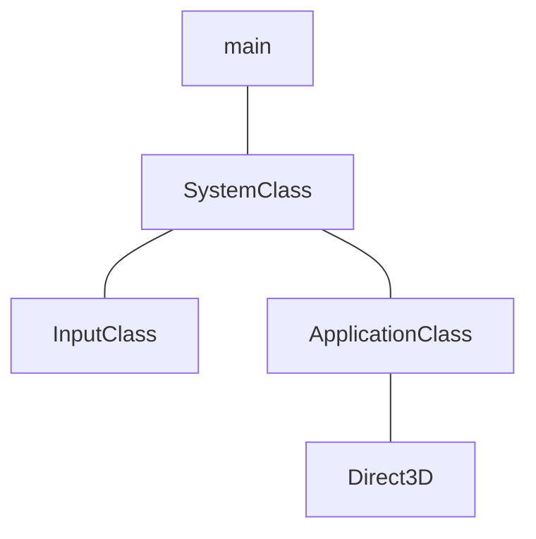

# RTK02_INITIALIZING-DX11



## ApplicationClass

```cpp
// ./Headers/aplicationclass.h
#ifndef _APPLICATIONCLASS_H_
#define _APPLICATIONCLASS_H_

const bool FULL_SCREEN = false;
const bool VSYNC_ENABLED = true;
const float SCREEN_DEPTH = 1000.0f;
const float SCREEN_NEAR = 0.3f;

class ApplicationClass
{
public:
	ApplicationClass();
	ApplicationClass(const ApplicationClass&);
	~ApplicationClass();

	bool Initialize(int, int, HWND);
	void Shutdown();
	bool Frame();

private:
	bool Render();
	D3DClass* m_Direct3D;
};
#endif

```

### ApplicationClass Constructors:

So, at first, we have the constructors and destructors as usually. Here we set `m_Direct3D` pointer to null, for safety reasons as we do with all class pointers.

```cpp
// ./Source/applicationclass.cpp
ApplicationClass::ApplicationClass()
{
	m_Direct3D = 0;
}
```

```cpp
// ./Source/applicationclass.cpp
ApplicationClass::ApplicationClass(const ApplicationClass& other)
{

}
```

```cpp
// ./Source/applicationclass.cpp
ApplicationClass::~ApplicationClass()
{

}
```

### ApplicationClass::Initialize

Here we create the D3DClass object and then call the D3DClass Initialize function. We send this function the screen width, height, hwnd and the four global variables from `applicationclass.h` file.

```cpp
// ./Source/applicationclass.cpp
bool ApplicationClass::Initialize(int screenWidth, int screenHeight, HWND hwnd)
{
	bool result;

// Create and initialize the Direct3D Object:
	m_Direct3D = new D3DClass;
	
	result = m_Direct3D->Initialize(screenWidth, screenHeight, 
	VSYNC_ENABLED, hwnd, FULL_SCREEN, SCREEN_DEPTH, SCREEN_NEAR);
	{
	
	}
}
```

### ApplicationClase::Shutdown

The shutdown function calls the `m_Direct3D` shutdown and sets it to null.

```cpp
// ./Source/applicationclass.cpp
void ApplicationClass::Shutdown()
{
        if (m_Direct3D)
        {
                m_Direct3D->Shutdown();
                delete m_Direct3D;
                m_Direct3D = 0;
        }

        return;
}
```

### ApplicationClass::Frame

The frame function calls the render function each frame.

```cpp
// ./Source/applicationclass.cpp
bool ApplicationClass::Frame()
{
        bool result;

        result = Render();
        if (!result)
        {
                return false;
        }

        return true;
}
```

### ApplicationClass::Render

We call the `m_Direct3D->BeginScene` to clear the screen to a gray color and then we call the `m_Direct3D->EndScene` so we can present it to the screen.

```cpp
// ./Source/applicationclass.cpp
bool ApplicationClass::Render()
{
        m_Direct3D->BeginScene(0.5f, 0.5f, 0.5f, 1.0f);
        m_Direct3D->EndScene();

        return true;
}
```

## D3DClass

```cpp
// ./Headers/d3dclass.h
#ifndef _D3DCLASS_H_
#define _D3DCLASS_H_

#pragma comment(lib, "d3d11.lib")
#pragma comment(lib, "dxgi.lib")
#pragma comment(lib, "d3dcompiler.lib")

#include <d3d11.h>
#include <DirectXMath.h>
using namespace DirectX;

class D3DClass
{
public:
        D3DClass();
        D3DClass(const D3DClass&);
        ~D3DClass();

        bool Initialize(int, int, bool, HWND, bool, float, float);
        void Shutdown();

        void BeginScene(float, float, float, float);
        void EndScene();

        ID3D11Device* GetDevice();
        ID3D11DeviceContext* GetDeviceContext();

        void GetProjectionMatrix(XMMATRIX&);
        void GetWorldMatrix(XMMATRIX&);
        void GetOrthoMatrix(XMMATRIX&);

        void GetVideoCardInfo(char*, int&);

        void SetBackBufferRenderTarget();
        void ResetViewport();

private:
        bool m_vsync_enabled;
        int m_videoCardMemory;
        char m_videoCardDescription[128];

        IDXGISwapChain* m_swapChain;
        ID3D11Device* m_device;
        ID3D11DeviceContext* m_deviceContext;
        ID3D11RenderTargetView* m_renderTargetView;
        ID3D11Texture2D* m_depthStencilBuffer;
        ID3D11DepthStencilState* m_depthStencilState;
        ID3D11DepthStencilView* m_depthStencilView;
        ID3D11RasterizerState* m_rasterState;

        XMMATRIX m_projectionMatrix;
        XMMATRIX m_worldMatrix;
        XMMATRIX m_orthoMatrix;

        D3D11_VIEWPORT m_viewport;
};

#endif
```

### D3DClass Constructors

So, here we start setting setting all the member pointers to null. 

```cpp
// ./Source/d3dclass.cpp
D3DClass::D3DClass()
{
        m_swapChain = 0;
        m_device = 0;
        m_deviceContext = 0;
        m_renderTargetView = 0;
        m_depthStencilBuffer = 0;
        m_depthStencilState = 0;
        m_depthStencilView = 0;
        m_rasterState = 0;
}
```

```cpp
// ./Source/d3dcass.cpp
D3DClass::D3DClass(const D3DClass& other)
{

}
```

```cpp
// ./Source/d3dclass.h
D3DClass::~D3DClass()
{

}
```

### `D3DClass::Initialize`

At first we initialize some important stuff which we will use inside the function.

```cpp
// ./Source/d3dclass.cpp
bool D3DClass::Initialize(int screenWidth, int screenHeight, bool vsync, HWND hwnd, bool fullscreen, float screenDepth, float screenNear)
{

        HRESULT result;

        IDXGIFactory* factory;
        IDXGIAdapter* adapter;
        IDXGIOutput* adapterOutput;

        unsigned int numModes, i, numerator, denominator;
        unsigned long long stringLength;

        DXGI_MODE_DESC* displayModeList;
        DXGI_ADAPTER_DESC adapterDesc;

        int error;

        DXGI_SWAP_CHAIN_DESC swapChainDesc;
        D3D_FEATURE_LEVEL featureLevel;
        ID3D11Texture2D* backBufferPTR;
        D3D11_TEXTURE2D_DESC depthBufferDesc;
        D3D11_DEPTH_STENCIL_DESC depthStencilDesc;
        D3D11_DEPTH_STENCIL_VIEW_DESC depthStencilViewDesc;
        D3D11_RASTERIZER_DESC rasterDesc;

        float fieldOfView, screenAspect;

        m_vsync_enabled = vsync;
```

- `HRESULT result`
    - Its a 1-bit code, where zero represents success and 1 represents failure.
- `IDXGIFactory* factory`
    - Its an interface object which is used to create factories.
- `IDXGIAdapter* adapter`
    - `IDXGIAdapter` is **an interface that represents a display subsystem, which includes video memory, DACs, and one or more GPUs**. It inherits from IDXGIObject.
- `IDXGIOutput* output`
    - The `IDXGIOutput` interface inherits from `IDXGIObject`. So, it can find the display mode that most closely matches a requested mode, it retrieves description of the output and lists avaliable display modes, get a copy of the current display surface and synchronizes rendering.
    
1. Setting up the Refresh Rate Parameters:
    
    So, before initializing dx we need to get the refresh rate from the video card/monitor. Each computer may be slightly different so we will need to query for that information. So we pass the numerator and denominator values to the DirectX during setup and it will calculate the proper refresh rate. Not doing this implies in using the default values which DirectX will respond by performing blit instead of a buffer flip which will affect performance and give us annoying errors in the debug output.
    
    1. Create the DirectX graphics Interface Factory:
        
        ```cpp
        // ./Source/d3dclass.cpp
        
        result = CreateDXGIFactory(__uuidof(DXGIFactory), (void**)&factory);
        if (FAILED(result))
        {
        	return false;
        }
        ```
        
        - `HRESULT CreateDXGIFactory`
        - The use of it is to generate objects that enumerate adapters, create swap chains and associate a window withe the alt+enter key sequence for toggling to and from the full screen display mode. If it succeeds, the reference count on the IDXGIFactory interface is incremented.
        - Parameter: `REFIID riid`
            - The globally unique identifier (GUID) of the IDXGIFactory object referenced by the `ppFactory` parameter.
        - Parameter: `**ppFactory`
            - Address of a pointer to an IDXGIFactory object.
    2. Use the Factory to create an Adapter for the Primary Graphics Interface (video card):
        
        ```cpp
        // ./Source/d3dclass.cpp
        
        result = factory->EnumAdapter(0, &adapter);
        if (FAILED(result))
        {
        	return false;
        }
        ```
        
        `HRESULT EnumAdapters`
        
        When you create a factory, the factory enumerates the set of adapters that are avaliable in the system. Therefore, if you change the adapters in a system, you must destroy and recreate the `IDXGIFactory` object.
        
        > `Syntax`
        > 
        > 
        > ```cpp
        > HRESULT EnumAdapters (
        > 			UINT          Adapter
        > [out] IDXGIAdapter  **ppAdapter
        > )
        > ```
        > 
        
        <aside>
        
        
        `Adapter`
        
        ---
        
        The Index if the adapter to enumerate.
        
        </aside>
        
        <aside>
        
        
        `**ppAdapter`
        
        ---
        
        The address of a pointer to an `IDXGIAdapter` interface at the position specified by the `Adapter` parameter. This parameter must not be `NULL`.
        
        </aside>
        
        When `EnumAdapter` method succeeds and fills the `&adapter`parameter with the address of the pointer to the adapter interface, `EnumAdapters` increments the adapter interfaces reference count. It first returns the `Adapter` with the output on which the desktop primary is displayed. This adapter corresponds with an index of zero. `EnumAdapters` next returns other adapters with outputs. `EnumAdapters` finally returns adapters without output.
        
    3. Enumerate the Primary Adapter Output (monitor):
        
        ```cpp
        // ./Source/d3dclass.cpp
        
        	result = adapter->EnumOutputs(0, &adapterOutput);
        	if (FAILED(result))
        	{
        		return false;
        	}
        ```
        
        `HRESULT EnumOutputs`
        
        - When the `EnumOutputs`method succeeds and fills the `adapterOutput` parameter with the address of the pointer to the output interface, `EnumOutputs` increments the output interfaces reference count. It first returns the output on which the desktop primary is displayed. This output corresponds with an index of zero.
            - Parameters: